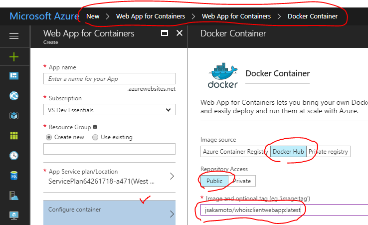

# WHOIS Client Web App/API

[](https://azuredeploy.net/)

## Summary

This is source code repository of the Web app which allows you to look up WHOIS information on Web browser, and also provide "CORS" enabled Web API endpoint.

## Official site

**Web UI - [https://whois.azurewebsites.net](https://whois.azurewebsites.net)**

**API Document - [https://whois.azurewebsites.net/swagger/](https://whois.azurewebsites.net/swagger/)**

## API document

### GET /api/whois/{query}

Send WHOIS protocol request recursive and return structured response.

#### Content-Type

`application/json`

#### Parameters

Parameter | Description | Parameter type | Data type
----------|-------------|----------------|-----------
**query** | **Domain name or IP address to query WHOIS information.** | path | string
server | [optional] Host name or IP address of WHOIS server. | query | string
port | [optional] Port number of WHOIS protocol. default value is 43. | query | integer
encoding | [optional] Encoding name to decode the text which responded from WHOIS servers. default value is 'us-ascii'. | query | string

#### Response

```JavaScript
{
  "OrganizationName": "string", // Organization name.
  "Raw": "string", // Raw response text of WHOIS protocol.
  "RespondedServers": [ // Responded servers host name.
    "string"
  ],
  "AddressRange": { // Range of IP address.
    "Begin": "string", // Begin of IP address in range.
    "End": "string" // End of IP address in range.
  }
}
```

#### Example

```
curl -H "Accept: application/json" "{host}/api/whois/{domain-name}"
```


### GET /api/rawquery

Send WHOIS protocol request to single server simply and return response as is.

#### Content-Type

`application/json`

#### Parameters

Parameter | Description | Parameter type | Data type
----------|-------------|----------------|-----------
**query** | **Domain name or IP address to query WHOIS information.** | query | string
**server** | **Host name or IP address of WHOIS server.** | query | string
port | [optional] Port number of WHOIS protocol. default value is 43. | query | integer
encoding | [optional] Encoding name to decode the text which responded from WHOIS servers. default value is 'us-ascii'. | query | string

#### Response

Response text of WHOIS protocol. (string)

#### Example

```
curl -H "Accept: application/json" "{host}/api/rawquery?query={domain-name}&server={whois-server-host-name}"
```

### GET /api/encodings

Get all encoding names that can specify the 'encoding' argument of APIs.

#### Content-Type

`application/json`

#### Parameters

nothing.

#### Response

```JavaScript
["string"] // The array of available encoding names.
```

#### Example

```
curl -H "Accept: application/json" "{host}/api/encodings"
```


## Implementation

- Server side codes are written by **C#** with **ASP.NET Core 2.0 Web API**.
- Client side codes are written by **TypeScript** with **Angular**.
- To talk with WHOIS servers, using **WhoisClient.NET** [](https://www.nuget.org/packages/WhoisClient.NET/)
- To support [Swagger](http://swagger.io/) specification and provide API document UI, using **Swashbuckle.AspNetCore** [](https://www.nuget.org/packages/Swashbuckle.AspNetCore/)
- The site design was made with **[Materialize](http://materializecss.com/)**

## Deploy your own site

### Docker image support

"WHOIS Client Web App/API" is also redistributed as a Docker image on Docket Hub.

https://hub.docker.com/r/jsakamoto/whoisclientwebapp/

You can get Docker image of "WHOIS Client Web App/API" like this:

```bash
$ docker pull jsakamoto/whoisclientwebapp:latest
```

and run it:

```bash
$ docker run -d --name whoisclientwebapp -p 80:80 jsakamoto/whoisclientwebapp
```

Afetr do this, you can open `http://localhost/` with any web browser and access to the "WHOIS Client Web App/API" UI.

### Deply to Microsoft Azure

The public cloud service "Microsoft Azure" provide "Web App for Containers" service.

You can deploy your own "WHOIS Client Web App/API" site on "Web App for Containers" service form docker image on Docker Hub like this figure:




### Deply to Heroku

Once you got the docker image of "WHOIS Client Web App/API", you can deploy docker image of "WHOIS Client Web App/API" to Heroku with this instruction:

```bash
$ heroku update
$ heroku login
$ heroku container:login

$ heroku apps:create {your-app-name}
$ docker tag jsakamoto/whoisclientwebapp registry.heroku.com/{your-app-name}/web
$ docker push registry.heroku.com/{your-app-name}/web
```


## License

[GNU General Public License v2](LICENSE)